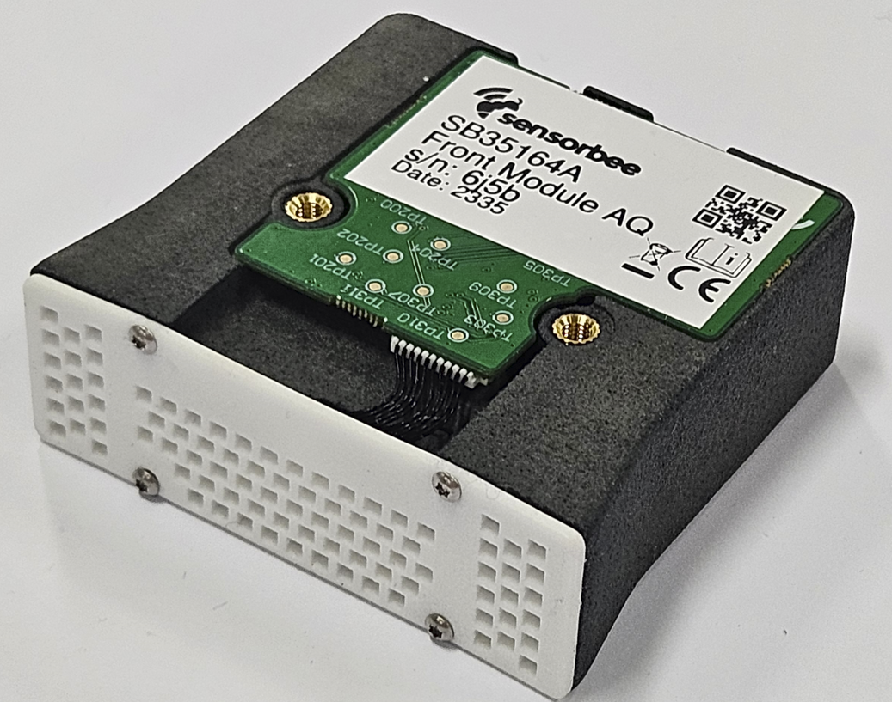

# Pressure Sensor

***

The pressure sensor gauges the ambient atmospheric pressure around it.

In the Sensorbee Pro series, encompassing both the Air Pro and Modbus Pro, the pressure sensor is situated within the front-end module (**SB3516**). Utilizing cutting-edge MEMS technology, the sensor accurately captures pressure readings, making it well-suited for diverse atmospheric monitoring tasks.

Figure 1.

For comprehensive sensor specifications and performance metrics, kindly consult the [SB3516 datasheet](https://www.notion.so/Datasheets-fd72e01b8f664506a6c6943291b0e92b?pvs=21).

The Sensorbee Lite series is not equipped with a pressure sensor.

## Installation

### Pro Series

Please refer to the particle sensor's documentation for installation instructions.
