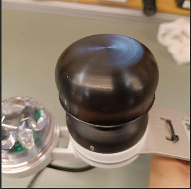

# Wind Sensor

## Wind Sensor

***

The Sensorbee ultrasonic wind sensor (**SB3611**) delivers precise measurement of both wind speed and direction using advanced ultrasonic technology. With no moving parts, this sensor offers long-lasting performance and minimal maintenance.\

Figure 1.

The wind sensor seamlessly integrates with our Sensorbee Pro series, connecting effortlessly through the external sensor port.

For detailed sensor specifications and performance data, please refer to the [SB3611 datasheet](https://www.notion.so/Datasheets-fd72e01b8f664506a6c6943291b0e92b?pvs=21).

Please note that this sensor is not compatible with the Sensorbee Lite series.

## Installation

When installing the wind sensor on a pole or wall, it's essential to position it correctly. For pole installation, use the two steel hose clamps provided. For wall mounting, utilize the screw holes in the base. The wind sensor has a marking to indicate North (see Figure 1). Rotate the sensor so this marking aligns with true North before tightening the three hex screws underneath the sensor (see figure 2).

Additionally, ensure the sensor installation is located away from any obstructions like trees or buildings, as these can impact the accuracy of wind measurements. A clear, elevated spot is recommended for optimal results.

<figure><figcaption></figcaption></figure>

Figure 1.

➡️ For the integration of additional external sensors, purchase the necessary \[cables] and \[Y-splitters] to ensure a seamless connection to the Pro unit.
